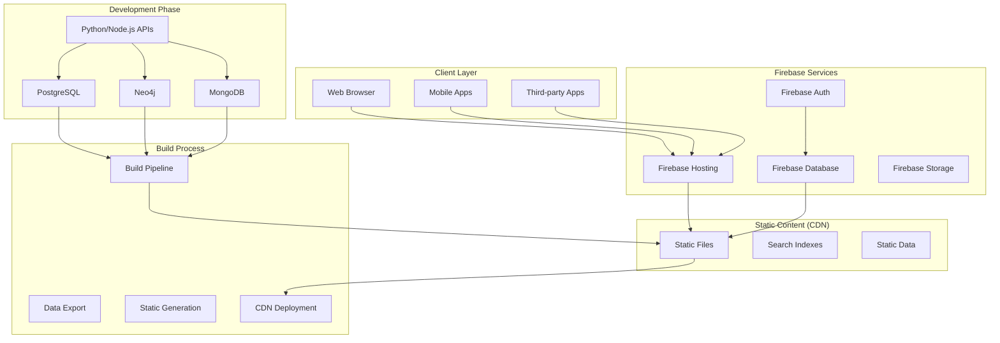
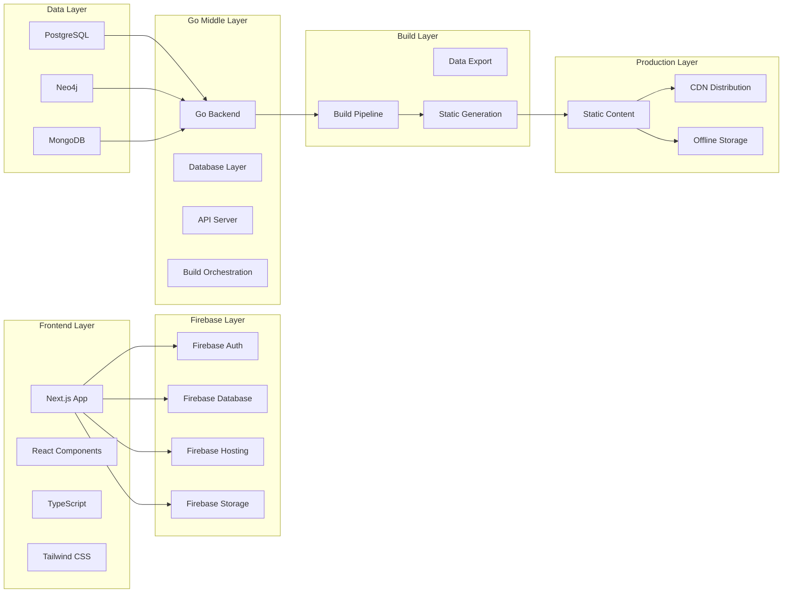
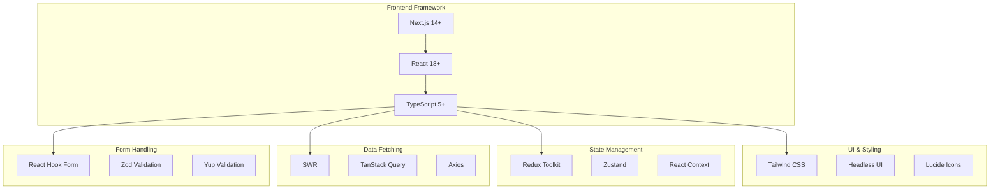
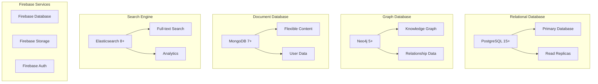
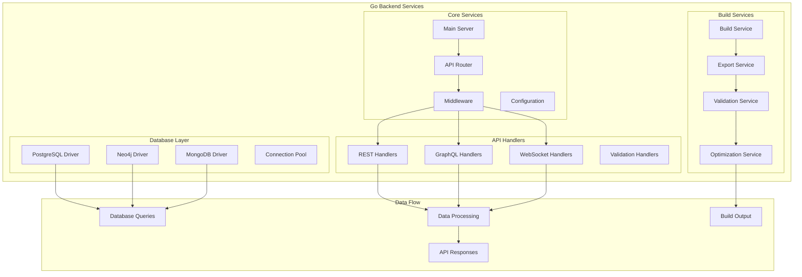

# MuslimTree.org - System Architecture Document

**Document Version:** 1.0  
**Last Updated:** December 2024  
**Project Status:** Planning & Development  
**Document Type:** System Architecture Document  
**Document Owner:** Technical Architecture Team

---

## Document Control

| Version | Date          | Author                      | Changes          |
| ------- | ------------- | --------------------------- | ---------------- |
| 1.0     | December 2024 | Technical Architecture Team | Initial creation |

---

## Executive Summary

This System Architecture Document defines the complete technical architecture for MuslimTree.org, including the technology stack, system components, data flow, build process, and deployment strategy. The architecture is designed to support 100% client-side production deployment with Firebase integration for dynamic features.

### Architecture Principles

- **100% Client-Side Production**: All Islamic knowledge data exported to static files
- **Go Middle Layer**: High-performance backend for development, testing, and build orchestration
- **Firebase Integration**: Authentication, hosting, and dynamic data management
- **Global CDN Distribution**: Zero server costs for static content
- **Offline Capability**: Full functionality without internet connection
- **Scalable Design**: Handle unlimited users through CDN distribution

---

## System Architecture Overview

### High-Level Architecture



### System Components Architecture



---

## Technology Stack

### Frontend Technology Stack



### Backend Technology Stack

```mermaid
graph TB
    subgraph "Primary Backend (Go)"
        GO[Go 1.21+]
        GF[Gin Framework]
        GR[Gorilla Mux]
        GC[Go Context]
    end

    subgraph "Data Layer"
        GD[Database Drivers]
        GP[PostgreSQL Driver]
        GN[Neo4j Driver]
        GM[MongoDB Driver]
    end

    subgraph "API Development"
        GQ[GraphQL (gqlgen)]
        RS[REST APIs]
        WS[WebSocket (Gorilla)]
        JM[JSON Processing]
    end

    subgraph "Build Process"
        GB[Build Orchestration]
        GE[Data Export]
        GS[Static Generation]
        BO[Optimization]
    end

    subgraph "AI & ML Integration"
        TF[TensorFlow Go]
        PT[PyTorch Go]
        SP[spaCy Integration]
        NL[NLTK Integration]
    end

    GO --> GF
    GO --> GR
    GO --> GD
    GD --> GP
    GD --> GN
    GD --> GM
    GO --> GQ
    GO --> RS
    GO --> WS
    GO --> GB
    GB --> GE
    GB --> GS
    GO --> TF
    GO --> PT
```

### Database Technology Stack



````

### Infrastructure Technology Stack

```mermaid
graph TB
    subgraph "Cloud Platform"
        GC[Google Cloud Platform]
        GCS[Cloud Storage]
        GCR[Cloud Run]
    end

    subgraph "Firebase Platform"
        FH[Firebase Hosting]
        FA[Firebase Auth]
        FD[Firebase Database]
        FS[Firebase Storage]
    end

    subgraph "CDN & Distribution"
        CF[Cloudflare]
        GCL[Google Cloud CDN]
        AK[Akamai]
    end

    subgraph "Monitoring & Analytics"
        GA[Google Analytics]
        GTM[Google Tag Manager]
        SE[Sentry]
        NP[New Relic]
    end

    subgraph "CI/CD Pipeline"
        GH[GitHub Actions]
        GCB[Google Cloud Build]
        AR[ArgoCD]
    end

    GC --> GCS
    GC --> GCR
    FH --> CF
    FH --> GCL
    GA --> GTM
    GH --> GCB
    GCB --> AR
````

---

## Data Architecture

### Database Schema Overview

```mermaid
erDiagram
    USERS {
        string user_id PK
        string email
        string first_name
        string last_name
        string language_preference
        datetime created_at
        datetime updated_at
        boolean is_verified
        string role
    }

    SCHOLARS {
        string scholar_id PK
        string name
        string kunya
        string laqab
        date birth_date
        date death_date
        string birth_location
        string death_location
        string biography
        string reliability_grade
    }

    HADITH {
        string hadith_id PK
        string mt_id
        text matn
        string source
        string grade
        string narrator_chain
        string[] topics
        datetime created_at
        datetime updated_at
    }

    QURAN_VERSES {
        string verse_id PK
        int surah_number
        int ayah_number
        text arabic_text
        text english_translation
        string[] qiraat
        string[] tafsir_sources
        string asbab_al_nuzul
    }

    FAMILY_TREES {
        string tree_id PK
        string root_scholar_id FK
        string parent_id FK
        string child_id FK
        string relationship_type
        string source
        datetime created_at
    }

    CONTRIBUTIONS {
        string contribution_id PK
        string user_id FK
        string content_type
        text content
        string status
        string[] validators
        datetime submitted_at
        datetime validated_at
        datetime published_at
    }

    USERS ||--o{ CONTRIBUTIONS : "submits"
    SCHOLARS ||--o{ FAMILY_TREES : "has_relationships"
    HADITH ||--o{ CONTRIBUTIONS : "can_be_contributed"
    QURAN_VERSES ||--o{ CONTRIBUTIONS : "can_be_contributed"
```

````

### Data Flow Architecture

```mermaid
flowchart TD
    subgraph "Data Sources"
        MS[Manuscripts]
        TB[Text Books]
        SC[Scholar Collections]
        UC[User Contributions]
    end

    subgraph "Data Processing"
        DP[Data Processing Pipeline]
        VL[Validation Layer]
        QC[Quality Control]
        TR[Transformation]
    end

    subgraph "Storage Layer"
        PG[PostgreSQL]
        NG[Neo4j]
        MG[MongoDB]
        ES[Elasticsearch]
    end

    subgraph "Build Process"
        BP[Build Pipeline]
        DE[Data Export]
        SG[Static Generation]
        SI[Search Index Creation]
    end

    subgraph "Production"
        CD[CDN Distribution]
        SC[Static Content]
        OF[Offline Storage]
        CL[Client-side Search]
    end

    MS --> DP
    TB --> DP
    SC --> DP
    UC --> DP
    DP --> VL
    VL --> QC
    QC --> TR
    TR --> PG
    TR --> NG
    TR --> MG
    TR --> ES
    PG --> BP
    NG --> BP
    MG --> BP
    ES --> BP
    BP --> DE
    DE --> SG
    SG --> SI
    SG --> CD
    SG --> SC
    SC --> OF
    SI --> CL
````

### Knowledge Graph Architecture

```mermaid
graph TB
    subgraph "Knowledge Graph (Neo4j)"
        subgraph "Core Entities"
            P[People/Scholars]
            H[Hadith]
            Q[Qur'an]
            B[Books]
            E[Events]
            PL[Places]
        end

        subgraph "Relationships"
            R1[TEACHES]
            R2[NARRATES]
            R3[REFERENCES]
            R4[OCCURS_IN]
            R5[AUTHORED]
            R6[RELATED_TO]
        end

        subgraph "Properties"
            PR1[Date]
            PR2[Location]
            PR3[Grade]
            PR4[Source]
            PR5[Language]
        end
    end

    P -->|R1| P
    P -->|R2| H
    H -->|R3| Q
    H -->|R3| B
    E -->|R4| PL
    P -->|R5| B
    H -->|R6| H
    Q -->|R6| H
```

---

## Go Middle Layer Architecture

### Go Backend Architecture Overview



````

### Go Project Structure

```mermaid
graph TB
    subgraph "Go Project Structure"
        subgraph "Command Layer"
            CM[cmd/]
            CM1[server/]
            CM2[builder/]
            CM3[exporter/]
        end

        subgraph "Internal Layer"
            IN[internal/]
            IN1[database/]
            IN2[api/]
            IN3[export/]
            IN4[build/]
        end

        subgraph "Package Layer"
            PK[pkg/]
            PK1[models/]
            PK2[utils/]
            PK3[config/]
            PK4[validation/]
        end

        subgraph "Scripts & Tools"
            SC[scripts/]
            SC1[build.sh]
            SC2[export.sh]
            SC3[test.sh]
        end
    end

    CM --> CM1
    CM --> CM2
    CM --> CM3
    IN --> IN1
    IN --> IN2
    IN --> IN3
    IN --> IN4
    PK --> PK1
    PK --> PK2
    PK --> PK3
    PK --> PK4
    SC --> SC1
    SC --> SC2
    SC --> SC3
````

````

### Go Development Workflow

```mermaid
flowchart TD
    subgraph "Development Mode"
        DC[Development Code]
        GO[Go Backend Server]
        PG[PostgreSQL]
        NG[Neo4j]
        MG[MongoDB]
        NX[Next.js Dev]
    end

    subgraph "Testing Mode"
        TC[Test Code]
        TG[Go Test Runner]
        TM[Test Data]
        TA[API Testing]
        TI[Integration Tests]
    end

    subgraph "Build Mode"
        BC[Build Command]
        GO[Go Build Service]
        DE[Data Export]
        SG[Static Generation]
        OP[Optimization]
    end

    subgraph "Production"
        FH[Firebase Hosting]
        CD[CDN Distribution]
        SC[Static Content]
    end

    DC --> GO
    GO --> PG
    GO --> NG
    GO --> MG
    GO --> NX
    TC --> TG
    TG --> TM
    TG --> TA
    TG --> TI
    BC --> GO
    GO --> DE
    DE --> SG
    SG --> OP
    OP --> FH
    FH --> CD
    FH --> SC
````

````

---

## Build Process Architecture

### Development to Production Pipeline

```mermaid
flowchart TD
    subgraph "Development Phase"
        DC[Development Code]
        PG[PostgreSQL Data]
        NG[Neo4j Data]
        MG[MongoDB Data]
        GO[Go Backend APIs]
    end

    subgraph "Build Phase"
        BP[Build Trigger]
        DE[Data Export]
        SG[Static Generation]
        SI[Search Index Build]
        OP[Optimization]
    end

    subgraph "Deployment Phase"
        FH[Firebase Hosting]
        CD[CDN Distribution]
        SC[Static Content]
        OF[Offline Assets]
    end

    subgraph "Production"
        US[User Access]
        CL[Client-side App]
        OF[Offline Functionality]
        SE[Search & Discovery]
    end

    DC --> BP
    PG --> DE
    NG --> DE
    MG --> DE
    API --> BP
    BP --> DE
    DE --> SG
    SG --> SI
    SI --> OP
    OP --> FH
    FH --> CD
    CD --> SC
    SC --> OF
    US --> CL
    CL --> OF
    CL --> SE
````

### Build Pipeline Details

```mermaid
flowchart LR
    subgraph "Source Control"
        GH[GitHub Repository]
        BR[Branch Management]
        PR[Pull Requests]
    end

    subgraph "CI/CD Pipeline"
        GA[GitHub Actions]
        TS[TypeScript Compilation]
        TG[Build Generation]
        TE[Testing]
    end

    subgraph "Data Processing (Go)"
        DP[Go Data Export]
        PGE[PostgreSQL Export]
        NGE[Neo4j Export]
        MGE[MongoDB Export]
    end

    subgraph "Static Generation"
        SGB[Next.js Build]
        SS[Static Export]
        SI[Search Index]
        OP[Optimization]
    end

    subgraph "Deployment"
        FH[Firebase Hosting]
        CD[CDN Distribution]
        MT[Monitoring]
    end

    GH --> GA
    GA --> TS
    TS --> TG
    TG --> TE
    TE --> DP
    DP --> PGE
    DP --> NGE
    DP --> MGE
    PGE --> SGB
    NGE --> SGB
    MGE --> SGB
    SGB --> SS
    SS --> SI
    SI --> OP
    OP --> FH
    FH --> CD
    CD --> MT
```

````

### Data Export Process

```mermaid
flowchart TD
    subgraph "Database Sources"
        PG[PostgreSQL]
        NG[Neo4j]
        MG[MongoDB]
        ES[Elasticsearch]
    end

    subgraph "Export Process (Go)"
        EP[Go Export Pipeline]
        DP[Data Processing]
        VT[Validation]
        TR[Transformation]
    end

    subgraph "Output Formats"
        JSON[JSON Files]
        XML[XML Files]
        CSV[CSV Files]
        SI[Search Indexes]
    end

    subgraph "Build Integration"
        BI[Build Integration]
        SG[Static Generation]
        OP[Optimization]
        DP[Deployment Prep]
    end

    PG --> EP
    NG --> EP
    MG --> EP
    ES --> EP
    EP --> DP
    DP --> VT
    VT --> TR
    TR --> JSON
    TR --> XML
    TR --> CSV
    TR --> SI
    JSON --> BI
    XML --> BI
    CSV --> BI
    SI --> BI
    BI --> SG
    SG --> OP
    OP --> DP
````

````

---

## Firebase Integration Architecture

### Firebase Services Integration

```mermaid
graph TB
    subgraph "Firebase Platform"
        subgraph "Authentication"
            FA[Firebase Auth]
            FA1[Email/Password]
            FA2[Google Sign-in]
            FA3[Phone Auth]
            FA4[Multi-factor]
        end

        subgraph "Database"
            FD[Firebase Database]
            FD1[User Profiles]
            FD2[Contributions]
            FD3[Validation Status]
            FD4[User Preferences]
        end

        subgraph "Hosting"
            FH[Firebase Hosting]
            FH1[Static Files]
            FH2[CDN Distribution]
            FH3[Custom Domain]
            FH4[SSL Certificates]
        end

        subgraph "Storage"
            FS[Firebase Storage]
            FS1[User Uploads]
            FS2[Profile Pictures]
            FS3[Documents]
            FS4[Media Files]
        end
    end

    subgraph "Client Integration"
        NX[Next.js App]
        RE[React Components]
        TS[TypeScript]
    end

    subgraph "Data Flow"
        DF1[Auth State]
        DF2[User Data]
        DF3[Real-time Updates]
        DF4[File Storage]
    end

    NX --> FA
    NX --> FD
    NX --> FH
    NX --> FS
    FA --> DF1
    FD --> DF2
    FD --> DF3
    FS --> DF4
````

````

### Firebase Data Structure

```mermaid
graph TB
    subgraph "Firebase Database Structure"
        subgraph "Users"
            U[users]
            U1[user_id]
            U2[profile]
            U3[preferences]
            U4[settings]
        end

        subgraph "Contributions"
            C[contributions]
            C1[contribution_id]
            C2[user_id]
            C3[content_type]
            C4[content]
            C5[status]
            C6[validators]
            C7[timestamps]
        end

        subgraph "Validation"
            V[validations]
            V1[validation_id]
            V2[contribution_id]
            V3[validator_id]
            V4[status]
            V5[comments]
            V6[timestamp]
        end

        subgraph "User Activity"
            A[user_activity]
            A1[activity_id]
            A2[user_id]
            A3[activity_type]
            A4[data]
            A5[timestamp]
        end
    end

    U --> U1
    U --> U2
    U --> U3
    U --> U4
    C --> C1
    C --> C2
    C --> C3
    C --> C4
    C --> C5
    C --> C6
    C --> C7
    V --> V1
    V --> V2
    V --> V3
    V --> V4
    V --> V5
    V --> V6
    A --> A1
    A --> A2
    A --> A3
    A --> A4
    A --> A5
````

````

### Firebase Authentication Flow

```mermaid
sequenceDiagram
    participant U as User
    participant C as Client App
    participant FA as Firebase Auth
    participant FD as Firebase Database
    participant S as Static Content

    U->>C: Access Application
    C->>S: Load Static Content
    U->>C: Click Login
    C->>FA: Initiate Auth
    FA->>U: Show Auth UI
    U->>FA: Enter Credentials
    FA->>C: Auth Success
    C->>FD: Fetch User Data
    FD->>C: Return User Profile
    C->>U: Show Authenticated UI
    U->>C: Submit Contribution
    C->>FD: Save Contribution
    FD->>C: Confirm Save
    C->>U: Show Success Message
````

````

---

## Deployment Architecture

### Production Deployment Flow

```mermaid
flowchart TD
    subgraph "Build Process"
        BC[Build Command]
        SG[Static Generation]
        OP[Optimization]
        TG[Testing]
    end

    subgraph "Firebase Deployment"
        FH[Firebase Hosting]
        FD[Firebase Database]
        FA[Firebase Auth]
        FS[Firebase Storage]
    end

    subgraph "CDN Distribution"
        CD[Cloudflare CDN]
        GC[Google Cloud CDN]
        ED[Edge Locations]
    end

    subgraph "Production"
        US[Global Users]
        OF[Offline Access]
        SE[Search Functionality]
        AU[Authentication]
    end

    BC --> SG
    SG --> OP
    OP --> TG
    TG --> FH
    FH --> CD
    FH --> GC
    CD --> ED
    GC --> ED
    ED --> US
    FH --> AU
    FD --> AU
    FA --> AU
    US --> OF
    US --> SE
    US --> AU
````

````

### CDN Distribution Strategy

```mermaid
graph TB
    subgraph "Global CDN Distribution"
        subgraph "Primary CDN"
            FH[Firebase Hosting]
            FH1[Static Files]
            FH2[SSL Certificates]
            FH3[Custom Domains]
        end

        subgraph "Secondary CDN"
            CF[Cloudflare]
            CF1[Edge Locations]
            CF2[DDoS Protection]
            CF3[Performance]
        end

        subgraph "Regional Distribution"
            NA[North America]
            EU[Europe]
            AS[Asia]
            AF[Africa]
            SA[South America]
            OC[Oceania]
        end

        subgraph "Edge Locations"
            EL1[Edge Location 1]
            EL2[Edge Location 2]
            EL3[Edge Location 3]
            EL4[Edge Location 4]
        end
    end

    FH --> CF
    CF --> NA
    CF --> EU
    CF --> AS
    CF --> AF
    CF --> SA
    CF --> OC
    NA --> EL1
    EU --> EL2
    AS --> EL3
    AF --> EL4
````

````

---

## Security Architecture

### Security Layers

```mermaid
graph TB
    subgraph "Security Architecture"
        subgraph "Application Security"
            AS1[Input Validation]
            AS2[Output Encoding]
            AS3[Session Management]
            AS4[Error Handling]
        end

        subgraph "Data Security"
            DS1[Encryption at Rest]
            DS2[Encryption in Transit]
            DS3[Access Controls]
            DS4[Audit Logging]
        end

        subgraph "Network Security"
            NS1[HTTPS/TLS]
            NS2[Firewall Rules]
            NS3[DDoS Protection]
            NS4[Rate Limiting]
        end

        subgraph "Infrastructure Security"
            IS1[Secure Configuration]
            IS2[Regular Updates]
            IS3[Vulnerability Scanning]
            IS4[Incident Response]
        end
    end

    subgraph "Firebase Security"
        FS1[Firebase Auth]
        FS2[Security Rules]
        FS3[API Keys]
        FS4[Access Control]
    end

    AS1 --> FS1
    AS2 --> FS2
    DS1 --> FS3
    DS2 --> FS4
    NS1 --> FS1
    NS2 --> FS2
    IS1 --> FS3
    IS2 --> FS4
````

````

### Authentication & Authorization Flow

```mermaid
sequenceDiagram
    participant U as User
    participant C as Client
    participant FA as Firebase Auth
    participant FD as Firebase Database
    participant S as Security Rules

    U->>C: Request Access
    C->>FA: Check Auth Status
    FA->>C: Return Auth State

    alt Authenticated User
        C->>FD: Request Data
        FD->>S: Check Permissions
        S->>FD: Validate Access
        FD->>C: Return Data
        C->>U: Display Content
    else Unauthenticated User
        C->>U: Show Login Prompt
        U->>C: Enter Credentials
        C->>FA: Authenticate
        FA->>C: Auth Success
        C->>FD: Request Data
        FD->>C: Return Data
        C->>U: Display Content
    end
````

````

---

## Performance Architecture

### Performance Optimization Strategy

```mermaid
graph TB
    subgraph "Performance Architecture"
        subgraph "Frontend Optimization"
            FO1[Code Splitting]
            FO2[Lazy Loading]
            FO3[Bundle Optimization]
            FO4[Image Optimization]
        end

        subgraph "CDN Optimization"
            CO1[Edge Caching]
            CO2[Gzip Compression]
            CO3[HTTP/2 Support]
            CO4[Cache Headers]
        end

        subgraph "Search Optimization"
            SO1[Client-side Search]
            SO2[Pre-built Indexes]
            SO3[Fuzzy Search]
            SO4[Search Caching]
        end

        subgraph "Data Optimization"
            DO1[Data Compression]
            DO2[Efficient Formats]
            DO3[Minimal Payload]
            DO4[Progressive Loading]
        end
    end

    subgraph "Performance Metrics"
        PM1[<2s Page Load]
        PM2[<500ms Search]
        PM3[99.9% Uptime]
        PM4[Global CDN]
    end

    FO1 --> PM1
    FO2 --> PM1
    CO1 --> PM3
    CO2 --> PM2
    SO1 --> PM2
    SO2 --> PM2
    DO1 --> PM1
    DO2 --> PM1
````

````

### Caching Strategy

```mermaid
flowchart TD
    subgraph "Caching Layers"
        subgraph "Browser Cache"
            BC1[Static Assets]
            BC2[CSS/JS Files]
            BC3[Images]
            BC4[Fonts]
        end

        subgraph "CDN Cache"
            CC1[Edge Caching]
            CC2[Regional Cache]
            CC3[Global Cache]
            CC4[Cache Invalidation]
        end

        subgraph "Application Cache"
            AC1[Search Indexes]
            AC2[User Data]
            AC3[Content Data]
            AC4[Offline Storage]
        end
    end

    subgraph "Cache Strategy"
        CS1[Static Content: 1 Year]
        CS2[Search Indexes: 1 Day]
        CS3[User Data: 1 Hour]
        CS4[Dynamic Content: No Cache]
    end

    BC1 --> CS1
    BC2 --> CS1
    CC1 --> CS1
    CC2 --> CS2
    AC1 --> CS2
    AC2 --> CS3
    AC3 --> CS1
    AC4 --> CS1
````

````

---

## Monitoring & Analytics Architecture

### Monitoring Stack

```mermaid
graph TB
    subgraph "Monitoring Architecture"
        subgraph "Application Monitoring"
            AM1[Sentry Error Tracking]
            AM2[Performance Monitoring]
            AM3[User Experience]
            AM4[Real-time Alerts]
        end

        subgraph "Infrastructure Monitoring"
            IM1[Google Cloud Monitoring]
            IM2[Firebase Analytics]
            IM3[CDN Performance]
            IM4[Uptime Monitoring]
        end

        subgraph "User Analytics"
            UA1[Google Analytics]
            UA2[User Behavior]
            UA3[Conversion Tracking]
            UA4[Custom Events]
        end

        subgraph "Business Intelligence"
            BI1[Content Analytics]
            BI2[User Engagement]
            BI3[Search Analytics]
            BI4[Performance Metrics]
        end
    end

    subgraph "Monitoring Dashboard"
        MD1[Real-time Metrics]
        MD2[Performance Reports]
        MD3[Error Tracking]
        MD4[User Analytics]
    end

    AM1 --> MD1
    AM2 --> MD2
    IM1 --> MD1
    IM2 --> MD3
    UA1 --> MD4
    UA2 --> MD4
    BI1 --> MD2
    BI2 --> MD4
````

````

### Analytics Data Flow

```mermaid
flowchart TD
    subgraph "Data Collection"
        DC1[User Interactions]
        DC2[Page Views]
        DC3[Search Queries]
        DC4[Performance Metrics]
    end

    subgraph "Data Processing"
        DP1[Google Analytics]
        DP2[Firebase Analytics]
        DP3[Custom Analytics]
        DP4[Performance Monitoring]
    end

    subgraph "Data Storage"
        DS1[Analytics Database]
        DS2[Data Warehouse]
        DS3[Real-time Streams]
        DS4[Historical Data]
    end

    subgraph "Data Analysis"
        DA1[Real-time Dashboards]
        DA2[Performance Reports]
        DA3[User Insights]
        DA4[Business Metrics]
    end

    DC1 --> DP1
    DC2 --> DP2
    DC3 --> DP3
    DC4 --> DP4
    DP1 --> DS1
    DP2 --> DS2
    DP3 --> DS3
    DP4 --> DS4
    DS1 --> DA1
    DS2 --> DA2
    DS3 --> DA3
    DS4 --> DA4
````

````

---

## Scalability Architecture

### Horizontal Scaling Strategy

```mermaid
graph TB
    subgraph "Scalability Architecture"
        subgraph "Static Content Scaling"
            SC1[CDN Distribution]
            SC2[Edge Locations]
            SC3[Global Coverage]
            SC4[Auto-scaling]
        end

        subgraph "Dynamic Content Scaling"
            DC1[Firebase Auto-scaling]
            DC2[Database Scaling]
            DC3[API Scaling]
            DC4[Storage Scaling]
        end

        subgraph "Performance Scaling"
            PS1[Client-side Processing]
            PS2[Offline Capability]
            PS3[Progressive Loading]
            PS4[Efficient Algorithms]
        end
    end

    subgraph "Scaling Metrics"
        SM1[10,000+ Concurrent Users]
        SM2[100,000+ Daily Users]
        SM3[1,000,000+ Total Users]
        SM4[Global Performance]
    end

    SC1 --> SM1
    SC2 --> SM2
    SC3 --> SM3
    SC4 --> SM4
    DC1 --> SM1
    DC2 --> SM2
    PS1 --> SM3
    PS2 --> SM4
````

````

### Load Distribution

```mermaid
flowchart TD
    subgraph "Load Distribution"
        subgraph "Geographic Distribution"
            GD1[North America]
            GD2[Europe]
            GD3[Asia]
            GD4[Other Regions]
        end

        subgraph "CDN Distribution"
            CD1[Primary CDN]
            CD2[Secondary CDN]
            CD3[Edge Locations]
            CD4[Load Balancing]
        end

        subgraph "Content Distribution"
            CO1[Static Content]
            CO2[Search Indexes]
            CO3[User Data]
            CO4[Media Files]
        end
    end

    subgraph "Performance Targets"
        PT1[<100ms Response Time]
        PT2[99.9% Uptime]
        PT3[Global Coverage]
        PT4[Offline Access]
    end

    GD1 --> CD1
    GD2 --> CD2
    GD3 --> CD3
    GD4 --> CD4
    CD1 --> CO1
    CD2 --> CO2
    CD3 --> CO3
    CD4 --> CO4
    CO1 --> PT1
    CO2 --> PT2
    CO3 --> PT3
    CO4 --> PT4
````

````

---

## Disaster Recovery & Backup

### Backup Strategy

```mermaid
flowchart TD
    subgraph "Backup Strategy"
        subgraph "Data Backup"
            DB1[PostgreSQL Backups]
            DB2[Neo4j Backups]
            DB3[MongoDB Backups]
            DB4[Firebase Backups]
        end

        subgraph "Content Backup"
            CB1[Static Content]
            CB2[Search Indexes]
            CB3[User Uploads]
            CB4[Configuration]
        end

        subgraph "Backup Schedule"
            BS1[Daily Incremental]
            BS2[Weekly Full]
            BS3[Monthly Archive]
            BS4[Real-time Sync]
        end
    end

    subgraph "Recovery Strategy"
        RS1[4 Hour RTO]
        RS2[15 Minute RPO]
        RS3[Automated Recovery]
        RS4[Testing Procedures]
    end

    DB1 --> BS1
    DB2 --> BS2
    DB3 --> BS3
    DB4 --> BS4
    CB1 --> BS1
    CB2 --> BS2
    CB3 --> BS3
    CB4 --> BS4
    BS1 --> RS1
    BS2 --> RS2
    BS3 --> RS3
    BS4 --> RS4
````

````

### Recovery Process

```mermaid
sequenceDiagram
    participant M as Monitoring System
    participant A as Alert System
    participant T as Technical Team
    participant B as Backup System
    participant R as Recovery System
    participant P as Production System

    M->>A: Detect Issue
    A->>T: Send Alert
    T->>B: Initiate Recovery
    B->>R: Restore Data
    R->>P: Deploy Recovery
    P->>M: Verify Recovery
    M->>T: Confirm Success
    T->>A: Clear Alert
````

```

---

## Conclusion

This System Architecture Document provides a comprehensive technical foundation for MuslimTree.org. The architecture is designed to support:

### **Key Architectural Benefits:**

- **100% Client-Side Production**: Zero server costs in production
- **Firebase Integration**: Seamless authentication and dynamic data management
- **Global CDN Distribution**: Worldwide performance and availability
- **Offline Capability**: Full functionality without internet connection
- **Scalable Design**: Handle unlimited users through CDN distribution

### **Technology Stack Summary:**

- **Frontend**: Next.js, React, TypeScript, Tailwind CSS
- **Backend**: Go (Golang) with Gin/Gorilla frameworks
- **Databases**: PostgreSQL, Neo4j, MongoDB, Firebase
- **Infrastructure**: Firebase Hosting, Google Cloud, CDN distribution
- **Build Process**: Go orchestrated static generation, data export, CDN deployment

### **Deployment Strategy:**

- **Development**: Full database and API development environment
- **Build**: Data export and static site generation
- **Production**: 100% static files on Firebase Hosting with CDN distribution
- **Dynamic Features**: Firebase Auth, Database, and Storage for user interactions

This architecture ensures that MuslimTree.org can serve millions of users globally with excellent performance, security, and user experience while maintaining zero server costs in production.

---

**Document Approval**
Technical Architect: [To be determined]
Development Lead: [To be determined]
Infrastructure Lead: [To be determined]
Project Manager: [To be determined]
Date: [To be determined]

**Next Review Date:** [To be determined]
**Document Owner:** Technical Architecture Team
```
